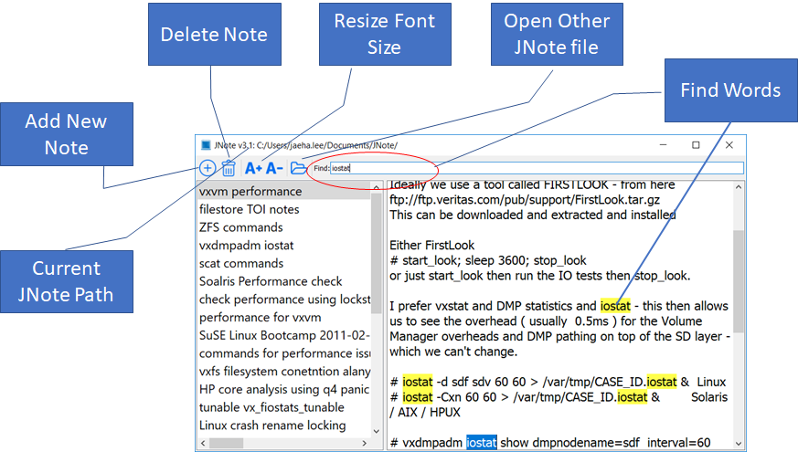

# JNote v4.0

Document from v3.2

Simple note application in Qt and SQLite.  Programmed by Jaeha Lee on Apr 2019.

## Features
- Full search words in entire notes
- Resize Font and dialog and it's persistent.
- Save as update note automatically.
- Attach any files by Drag and Drop into text area.
- Read other db.jnote by drag and drop
- Copy attached file by drag abd drop

## Binary Installation
For Mac, download jNote32.dmg, and copy to Application.
For Windows, download jNote32-static.zip(single file) or -x86-dynamic(shared lib) and extract into any folder.

~/Documents/JNote will be default location for the JNote data.

  
## Source Comopile
Download all the files under 'src', and open the JNote.pro from Qt Creator and compile it.  I used Qt 5.6 to create binaries.

  
## Usage

- To add new note, just click add button and start to write on right text area.  All changes will be saved automatically.
- Remove button will remove current note.
- You can also open another JNote using 'Open', but this is only avilable that session.  When close, default JNote under Documents will be used.
- Full text search on 'Find'.
- Ctrl+F will allow search in the current note.
- Attach file by Drag and Drop to text area.  if it's text file, you will have option to copy into text as well.

  
 Enjoy!!
